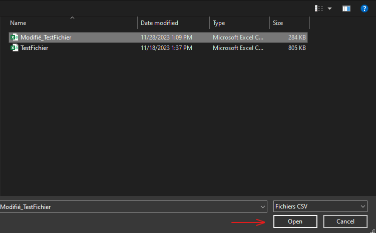
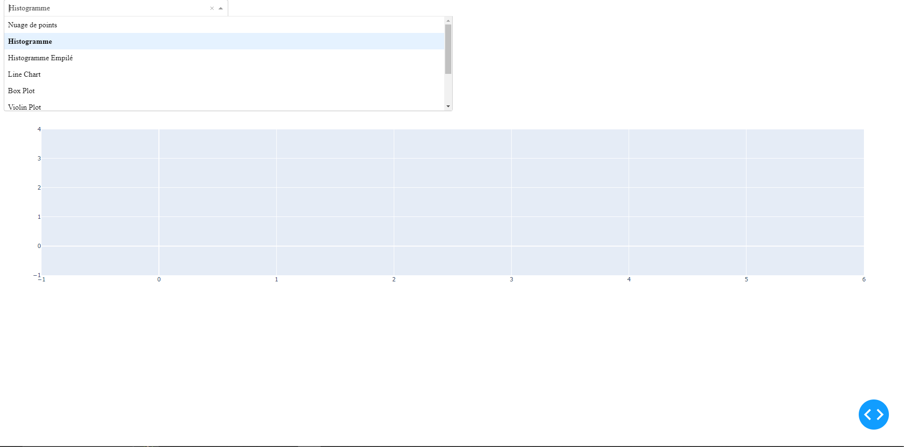
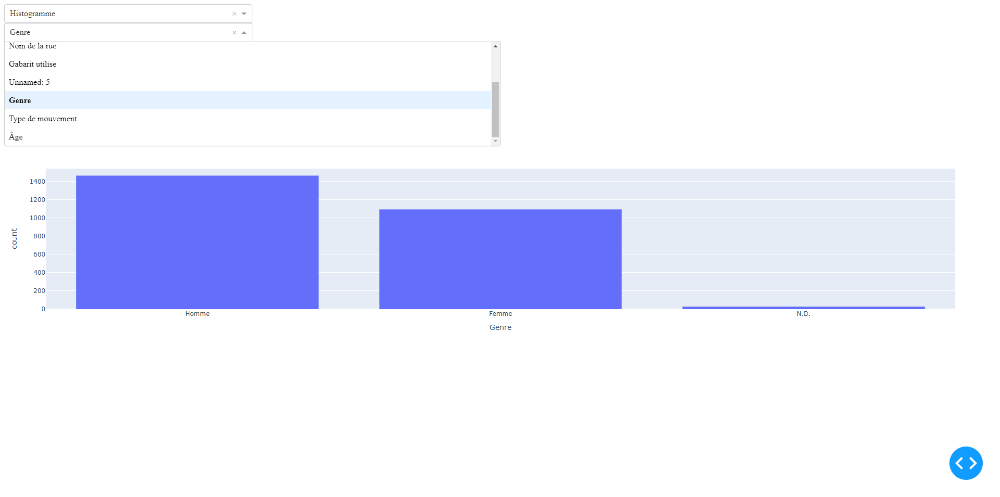
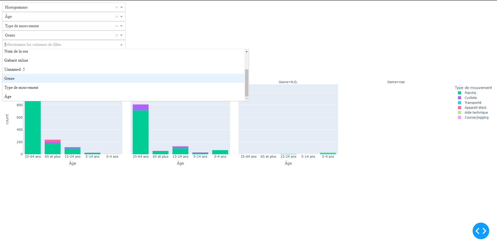
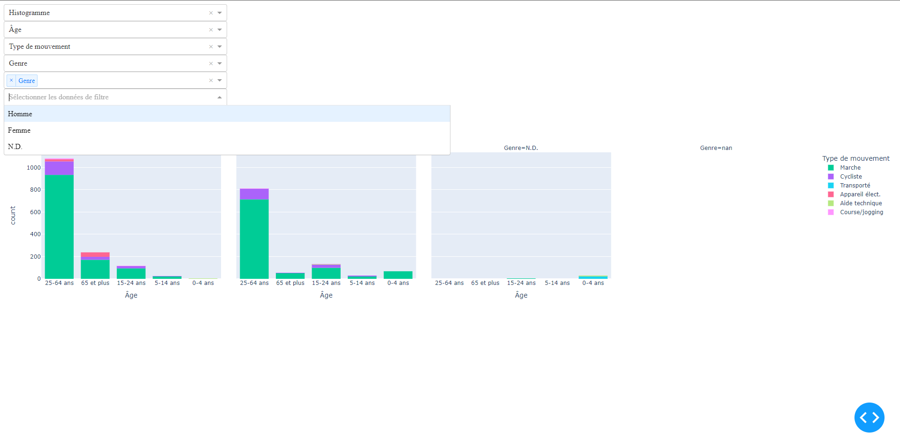
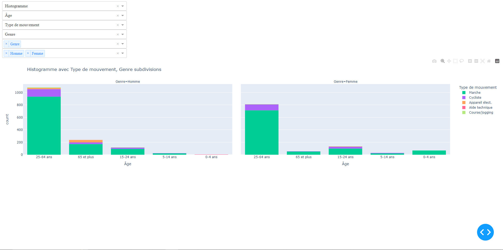

# Processing CSV data to obtain interactive web graphs
## Dash Application User Guide
This Dash application has been developed to allow users to easily explore and visualize data contained in a CSV file. The application provides a user-friendly interface with dropdown menus for column selection, filters, and types of graphs.
> [!IMPORTANT]
> This application is designed to work with CSV files. Make sure your data is properly formatted in a CSV file before loading it into the application. Each data entry should be separated into columns.

## Prerequisites
> [!IMPORTANT]
> Before using this application, make sure you have Python 3.7 or higher installed along with the required libraries. You can install the dependencies by running the following commands:

```bash
pip install dash 
pip install pandas 
pip install plotly
```

# Usage
## Loading the CSV File
When you launch the application, a file selection dialog will automatically appear. Select the CSV file containing your data.



## Graph Type Selection
Use the dropdown menu to select the type of graph you want to display. Available options include: 
- Scatter Plot
- Histogram
- Stacked Histogram
- Line Chart
- Box Plot
- Violin Plot
- 3D Scatter Plot
- Pie Chart
- Donut Chart



## Column Selection
Once the file is loaded, you'll see a dropdown list allowing you to select the column to use as the x and y axis for the graph. You can also add a third variable.



## Filter Selection
Use the filter column dropdown menus to select the columns on which you want to filter the data.



After selecting a filter column, a dropdown list of the unique values available in that column will appear. You can select one or more values to filter the data.



## Displaying the Graph
Once you've selected the desired options, the corresponding graph will be automatically generated and displayed in the output area.



## Interactivity
You can interact with the graph using Plotly's native features. For example, zooming, scrolling, hovering for detailed information, etc.

## Resetting Filters
To reset the selected filters, simply uncheck all selected options in the filter dropdown menus.

> [!NOTE]
> An additional code is provided to transform string json data into columns.
> 
> [Convertir.py](./Donnees/Convertir.py)
> 
> This will create a new CSV file with the corrected data, called Modified_X, where X is the original file name.
